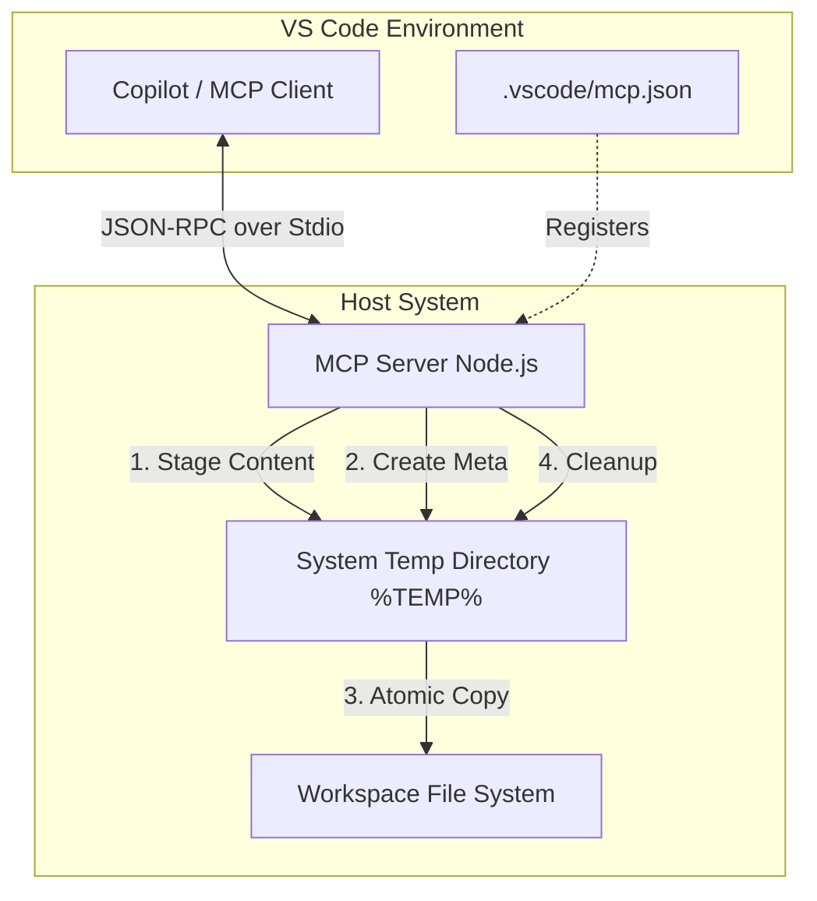
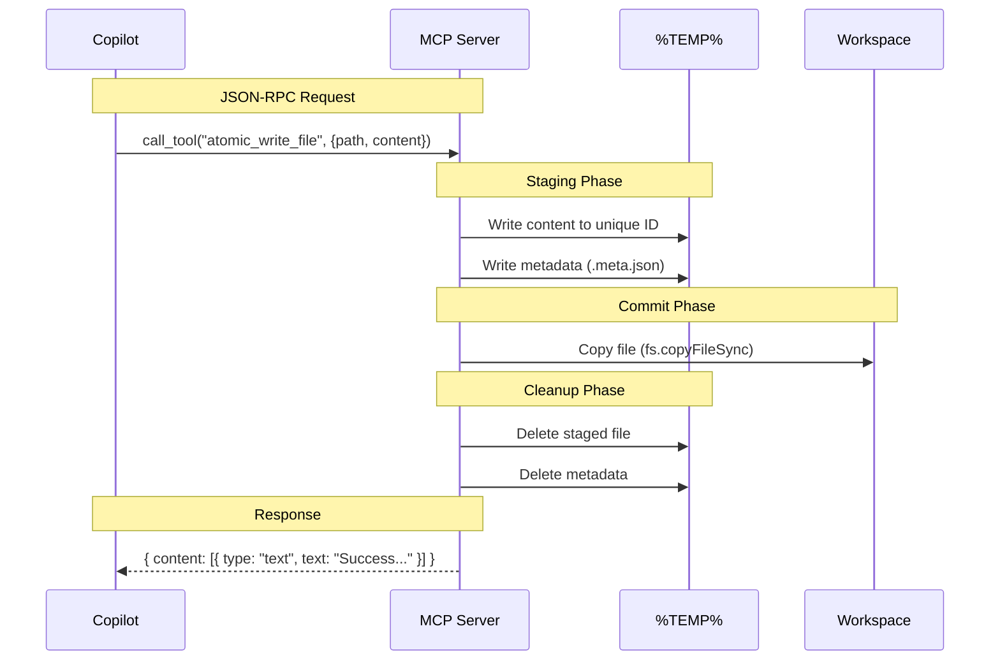

# Local File Operations MCP Server

This directory contains a **Model Context Protocol (MCP)** server designed to provide robust, atomic file operations for AI agents (specifically GitHub Copilot) running within Visual Studio Code.

Its primary purpose is to allow agents to create and modify files in the workspace **without triggering VS Code's "Keep/Undo" UI** or opening "Preview Mode" editors, which often disrupt automated workflows.

## Architecture

The server runs locally as a Node.js process, communicating with the MCP Client (VS Code) via Standard Input/Output (Stdio). It implements a "Staged Write Protocol" to ensure atomicity and bypass editor-level file watchers during the creation phase.

### System Overview



### Atomic Write Sequence

The `atomic_write_file` tool follows a strict sequence to ensure data integrity and UI silence.



## Quickstart

### 1. Prerequisites
*   **Node.js**: Version 18 or higher.
*   **VS Code**: With the GitHub Copilot extension installed.

### 2. Installation
Navigate to this directory and install the dependencies:

```bash
cd mcp-server
npm install
```

### 3. Configuration
Register the server in your workspace configuration so VS Code can discover it.

**File:** `.vscode/mcp.json`

```json
{
  "mcpServers": {
    "local-ops": {
      "command": "node",
      "args": ["${workspaceFolder}/mcp-server/index.js"],
      "disabled": false,
      "autoAllow": true
    }
  }
}
```

*   **`autoAllow: true`**: Critical for automated workflows. It prevents VS Code from asking for permission every time the agent tries to write a file.

## Tools

### `atomic_write_file`
Writes a file to the specified path using the staged protocol.

*   **Arguments**:
    *   `path` (string): Absolute path to the target file.
    *   `content` (string): The text content to write.
*   **Behavior**:
    *   Creates directories recursively if they don't exist.
    *   Overwrites existing files.
    *   Silent operation (logs only to stderr if an error occurs).

## Lifecycle & Interop

### Lifecycle
*   **Startup**: VS Code starts the MCP server automatically when the workspace is opened (if configured in `mcp.json`).
*   **Runtime**: The server runs as a persistent background process.
*   **Shutdown**: VS Code terminates the process when the window is closed or reloaded.

### Interoperability
This server uses the standard Model Context Protocol over Stdio. It can be used by any MCP-compliant client, not just VS Code.

**Example: Claude Desktop Configuration**
To use this server with Claude Desktop, add it to your `claude_desktop_config.json`:

```json
{
  "mcpServers": {
    "run-process-monitor-ops": {
      "command": "node",
      "args": ["/absolute/path/to/repo/mcp-server/index.js"]
    }
  }
}
```

## Dependencies

*   **`@modelcontextprotocol/sdk`**: The official SDK for building MCP servers.
*   **Node.js Built-ins**: `fs`, `path`, `child_process`.

## Troubleshooting

*   **Tool not showing up**: Reload the VS Code window (`Developer: Reload Window`).
*   **Permission Errors**: Ensure the user running VS Code has write access to both the workspace and the system `%TEMP%` directory.
*   **Debugging**: Since the server runs over Stdio, you cannot easily attach a debugger. Use `console.error()` to print logs to the "MCP Servers" output channel in VS Code.
